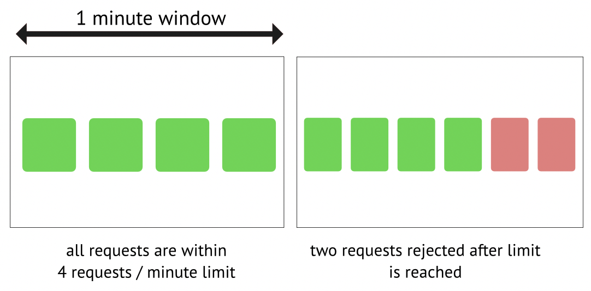
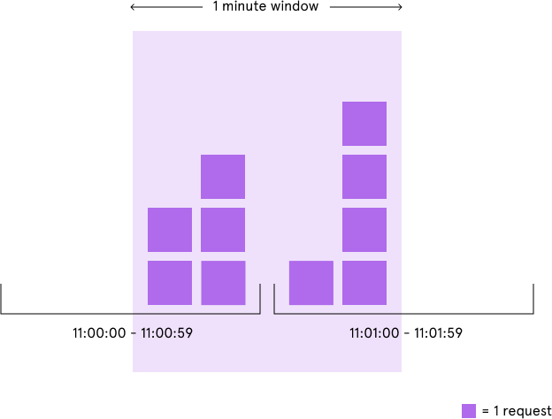

# Rate limiter
There are various methods to implement a rate limiter. Here, I have devised two solutions. First, set up a rate-limiting middleware for routing. Second, establish a proxy, such as Nginx.

I have only implemented a middleware, as configuring both solutions would be resource-intensive for me. Implementing a middleware can be more challenging than configuring plugins like Nginx, Envoy, and Kong, so I prefer to take on the more difficult task.

## Rate limit Middleware

There are various algorithms available for achieving rate limiting. I have opted for two classical approaches: fixed window and sliding window. As I employ Redis for the counter, and distributed Redis can be quite complex, I have decided to use a single-instance Redis. I assume there are distributed service nodes connected to this single Redis node.


**Note**: The endpoint limit is registered before the account limit. Once the endpoint limit is exceeded, the account limit won't be triggered.
## Fixed Window
Limit by a fixed window start from first request comes.



### Race condition
Since using a "get-then-conditional-set" approach might lead to a race condition, let's consider a scenario where A and B represent two different servers in our cluster. If an account sends two requests simultaneously and these requests are dispatched to A and B servers concurrently, a race condition could arise.
```
// assume limit value is 5
A: get->4
B: get->4
A: incr->5
B: incr->5
```


To mitigate this issue, we can employ a Redis lock, the WATCH command, and a Lua script. Given that writing Lua scripts is more straightforward to implement, I have chosen this method.

## Sliding Window
Followed by the vedio: [rate limit using redis](https://www.youtube.com/watch?v=CRGPbCbRTHA)



The last one is using a sorted set. Multiple sorted set commands can be grouped together using `$redis.multi` to execute them atomically, avoiding race condition scenarios.

The specific idea is:

1. Use a sorted set to store all timestamps.
1. When a request comes in, use `ZREMRANGEBYSCORE` to discard keys outside the time window.
1. Retrieve all remaining elements in the sorted set using `ZRANGE(0, -1)`.
1. Add the current operation using `ZADD` and extend the TTL of the sorted set.
1. Calculate the total number of elements in the entire sorted set to determine the number of accesses.


# Usage

## Prerequisites
1. Ports availible: 8080, 6379
2. Docker installed
3. Go installed (to run the test scripts)

## Config
limiter config is located at `config/limit_config.yaml` folder. In struct of
```yaml
AccountLimit: # limit for each account
  Duration: 60s
  Value: 10 # request count
  LimitType: 0 # {0: sliding window, 1: fixed window}
EndpointLimit: # limit for each endpoints
  Duration: 60s
  Value: 11
  LimitType: 0

```
Since the config is not hot reload. Use `docker compose up` again for reload the config for testing.

```shell
make compose_up
make compose_down
```
## Testcase
Testcases are under `test` folder, 4 test case is available.
Make sure the configure the `config/limit_config.yaml` before running the test.


1. **Asynchronized test account limit**: send 11 requests with same account asynchronizely
```
// account limit: {11/60s}, endpoint limit: {10/60s}
$make test_async_account_limit
```
2. **Synchronized test account limit**: send 11 requests with same account synchronizely
```
// account limit: {11/60s}, endpoint limit: {10/60s}
$make test_sync_account_limit
```
3. **Asynchronized test endpoint limit**: send 5 requests with account1 and 6 requests with account2 asynchronizely.
```
// account limit: {10/60s}, endpoint limit: {11/60s}
$make test_sync_endpoint_limit
```
4. **Synchronized test endpoint limit**: send 5 requests with account1 and 6 requests with account2 synchronizely.
```
// account limit: {10/60s}, endpoint limit: {11/60s}
$make test_async_endpoint_limit
```

# Backlog

There are some optimization can be done. While I think they are just time comsuming instead of hard to implement so I skip them. I record some of them here.

1. **Rate limit on load balancer**: This Nginx configuration sets up a rate limit zone named one with a limit of 1 request per second (rate=1r/s). The burst parameter allows a burst of up to 5 requests before enforcing the rate limit.


```nginx
http {
    limit_req_zone $binary_remote_addr zone=one:10m rate=1r/s;

    server {
        location / {
            limit_req zone=one burst=5;
            proxy_pass http://up_stream_server;
        }
    }
}
```


2. **Config hot reload**: Reload limit config in realtime can be done by a scheduled task using another goroutine.
3. **Network Configuration**: Currently, network ports are exposed unsafely and directly mapping. It can be enhanced by setting up forward proxy.
4. **Service Architechture**: There are some of entities make the codebase have low readibility. This can improved by struct decoupling and dependecy injection.


